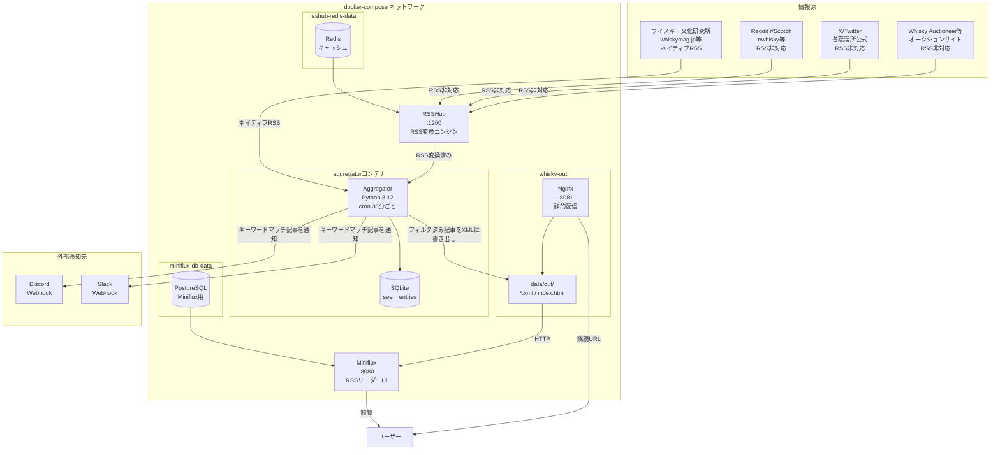

# whisky-rss アーキテクチャドキュメント

> 最終更新: 2026-05-28

---

## プロジェクト概要

**whisky-rss** は、ウイスキー関連の情報を自動収集・フィルタ・通知するセルフホスト型の情報集約ハブです。

- **目的**: RSS対応・非対応を問わずウイスキー情報源を一括購読し、キーワードルールで重要な記事だけを Discord / Slack に通知する
- **運用形態**: Docker Compose によるローカル/VPS 常駐サービス
- **実行間隔**: デフォルト30分ごと（cronで制御）

---

## 技術スタック

| レイヤー | 技術 | バージョン | 役割 |
|----------|------|------------|------|
| コンテナ基盤 | Docker / docker-compose | - | サービスオーケストレーション |
| RSS変換エンジン | [RSSHub](https://docs.rsshub.app/) | latest | RSS非対応サイト（X, Reddit等）をRSS化 |
| RSSHubキャッシュ | Redis | alpine | RSSHubのレスポンスキャッシュ |
| 集約・通知スクリプト | Python | 3.12-slim | フィード取得・フィルタ・通知・RSS出力 |
| Pythonライブラリ | feedparser | 6.0.11 | RSSフィード解析 |
| | requests | 2.32.3 | HTTP通信（Webhook送信） |
| | PyYAML | 6.0.2 | 設定ファイル読み込み |
| | python-dateutil | 2.9.0.post0 | 日付パース |
| | feedgen | 1.0.0 | 出力RSS XML生成 |
| 既読管理DB | SQLite | - | 記事の既読・重複排除・フィルタ済み記事管理 |
| 静的配信 | Nginx | alpine | フィルタ済みRSS XMLをHTTPで配信 |
| RSSリーダーUI | [Miniflux](https://miniflux.app/) | latest | セルフホスト型WebUI（任意） |
| MinifuxDB | PostgreSQL | 15-alpine | MinifuxのデータストアI |
| 定期実行 | cron（コンテナ内） | - | 30分ごとにaggregatorを起動 |

---

## システム構成図



### ポート一覧

| サービス | ホストポート | コンテナポート | 用途 |
|----------|------------|--------------|------|
| RSSHub | 1200 | 1200 | RSS変換API |
| Miniflux | 8080 | 8080 | WebブラウザでのRSS閲覧UI |
| whisky-out (Nginx) | 8081 | 80 | フィルタ済みRSS XML配信 |

---

## ディレクトリ構成

```
whisky-rss/
├── docker-compose.yml          # 全サービスの定義（rsshub / miniflux / aggregator / whisky-out）
├── .env                        # 環境変数（Webhook URLなど）※ gitignore
├── .env.example                # 設定例
├── .gitignore
├── README.md
├── OPERATIONS.md               # 運用手順書
│
├── config/                     # 設定ファイル（aggregatorコンテナに読み取り専用でマウント）
│   ├── feeds.yaml              # 購読フィード一覧（ID / URL / カテゴリ / 有効フラグ）
│   └── keywords.yaml           # 通知キーワードルール（include / exclude / 通知先チャンネル）
│
├── aggregator/                 # Pythonスクリプト群（Dockerイメージとしてビルド）
│   ├── Dockerfile              # python:3.12-slim ベース、cron込み
│   ├── requirements.txt        # feedparser / requests / PyYAML / feedgen 等
│   ├── crontab                 # */30 * * * * で main.py を実行
│   ├── main.py                 # エントリポイント（フィード取得・フィルタ・通知・RSS出力）
│   ├── notifier.py             # Discord / Slack Webhook送信
│   ├── storage.py              # SQLite 既読管理（seen_entries テーブル）
│   └── rss_writer.py           # フィルタ済み記事をRSS XML / index.htmlに書き出し
│
├── data/                       # 永続データ（ホストにマウント）
│   ├── whisky.sqlite           # 既読・フィルタ済み記事DB
│   ├── aggregator.log          # cronのログ出力先
│   └── out/                    # Nginxが配信するRSS XMLと index.html
│       ├── index.html
│       ├── all.xml
│       ├── japanese-whisky.xml
│       ├── auction.xml
│       └── world-whisky.xml
│
└── scripts/
    └── run-local.sh            # Docker不要のローカル動作確認用スクリプト
```

---

## データフロー

### 1. フィード取得〜既読チェック

```
[cron 30分ごと]
    │
    ▼
main.py 起動
    │
    ├─ config/feeds.yaml を読み込み（有効なフィードのみ）
    ├─ config/keywords.yaml を読み込み（ルール定義）
    │
    ▼
各フィードに対して feedparser.parse(url) でHTTP取得
    │
    ├─ RSSHubが必要なフィード: feeds.yaml の ${RSSHUB} が RSSHUB_BASE_URL に展開される
    │   例）${RSSHUB}/reddit/subreddit/scotch/hot → http://rsshub:1200/reddit/subreddit/scotch/hot
    │
    ▼
各エントリ（記事）に対して
    ├─ entry_id = SHA1(feed_id + entry.id + entry.link) でユニークID生成
    └─ SQLite seen_entries テーブルで既読チェック → 既読ならスキップ
```

### 2. キーワードフィルタ〜通知

```
新規エントリ（未既読）
    │
    ▼
keywords.yaml のルールを上から順に照合
    ├─ exclude キーワードを含む → このルールをスキップ
    ├─ include キーワードを含む → ルールにマッチ
    └─ いずれにもマッチしない → 通知なし（DBには保存）
    │
    ▼（ルールマッチした場合）
channels に指定された通知先へ送信
    ├─ "discord" → Discord Embed形式でWebhook POST
    └─ "slack"  → Slack mrkdwn形式でWebhook POST
    │
    ▼
SQLite seen_entries に記録
    ├─ matched_rule: マッチしたルール名
    ├─ notified_at: 通知日時
    └─ summary: 本文冒頭テキスト（HTMLタグ除去済み）
```

### 3. 出力RSS生成〜配信

```
全フィード処理完了後
    │
    ▼
SQLite から直近30日の通知済み記事を取得
    ├─ all: 全ルール横断（300件上限）
    ├─ japanese-whisky, lottery, auction, world-whisky: ルール別
    │
    ▼
feedgen で RSS 2.0 XML を生成 → data/out/{rule}.xml に書き出し
    + index.html（購読URL一覧）も生成
    │
    ▼
Nginx (whisky-out) が data/out/ を静的配信
    → http://localhost:8081/{rule}.xml で外部から購読可能
    → Miniflux に登録してWebブラウザで閲覧可
```

---

## SQLiteスキーマ

### `seen_entries` テーブル

| カラム | 型 | 説明 |
|--------|-----|------|
| `id` | TEXT (PK) | SHA1(feed_id + entry.id + link) |
| `feed_id` | TEXT | フィードのID（feeds.yamlのid） |
| `title` | TEXT | 記事タイトル |
| `link` | TEXT | 記事URL |
| `published` | TEXT | 元フィードの公開日時 |
| `first_seen_at` | TEXT | 初回取得日時（SQLite datetime） |
| `matched_rule` | TEXT | マッチしたキーワードルール名（NULLなら通知なし） |
| `summary` | TEXT | 本文冒頭テキスト（HTMLタグ除去済み） |
| `notified_at` | TEXT | 通知日時（matched_ruleがある場合のみ） |

インデックス: `idx_seen_feed (feed_id)`, `idx_seen_rule (matched_rule)`

---

## インフラ・デプロイ

### Docker Compose構成

```
docker-compose.yml
│
├─ rsshub          (diygod/rsshub:latest)
│   └─ depends_on: rsshub-redis
│
├─ rsshub-redis    (redis:alpine)
│   └─ volume: rsshub-redis-data
│
├─ miniflux        (miniflux/miniflux:latest) ※任意
│   └─ depends_on: miniflux-db
│
├─ miniflux-db     (postgres:15-alpine)
│   └─ volume: miniflux-db-data
│
├─ aggregator      (ローカルビルド ./aggregator/Dockerfile)
│   ├─ depends_on: rsshub
│   ├─ volume: ./config → /app/config (ro)
│   └─ volume: ./data → /app/data
│
└─ whisky-out      (nginx:alpine)
    └─ volume: ./data/out → /usr/share/nginx/html (ro)
```

### 環境変数（.env）

| 変数名 | デフォルト | 説明 |
|--------|-----------|------|
| `RSSHUB_BASE_URL` | `http://rsshub:1200` | aggregatorからRSSHubへの内部URL |
| `DISCORD_WEBHOOK_URL` | 空（通知なし） | Discord Webhook URL |
| `SLACK_WEBHOOK_URL` | 空（通知なし） | Slack Webhook URL |
| `FETCH_INTERVAL_MIN` | `30` | 取得間隔（分）※cronと合わせて変更 |
| `NOTIFY_BODY_MAX_CHARS` | `400` | 通知本文の最大文字数 |
| `MINIFLUX_DB_PASSWORD` | - | Miniflux用PostgreSQLパスワード |
| `MINIFLUX_ADMIN_USER` | `admin` | MinifuxI管理者ユーザー名 |
| `MINIFLUX_ADMIN_PASSWORD` | - | Miniflux管理者パスワード |
| `WHISKY_OUT_PUBLIC_URL` | `http://whisky-out` | 出力RSSのself URL（Miniflux用） |

### 起動方法

```bash
# 初回セットアップ
cp .env.example .env
# .env を編集して Webhook URL等を設定

# 全サービス起動
docker compose up -d

# ログ確認
docker compose logs -f aggregator

# フィード/キーワード変更後の再読み込み
docker compose restart aggregator
```

### ローカルテスト（Docker不要）

```bash
./scripts/run-local.sh
# .env を読み込み、venv を作成してaggregatorを1回実行
```

### データ永続化とバックアップ

- **既読DB**: `data/whisky.sqlite`（このファイルをバックアップすれば既読履歴を保全できる）
- **Minifluxデータ**: `miniflux-db-data` Dockerボリューム（購読リストはMinifuxUIからOPMLエクスポート可）
- **出力XML**: `data/out/`（aggregatorが毎回再生成するため、バックアップ不要）

---

## 外部サービス連携

### 通知連携

| サービス | 連携方式 | 送信形式 | 設定箇所 |
|----------|----------|----------|---------|
| Discord | Incoming Webhook | Embed（タイトル・URL・本文・フッタ） | `.env` の `DISCORD_WEBHOOK_URL` |
| Slack | Incoming Webhook | mrkdwn形式テキスト | `.env` の `SLACK_WEBHOOK_URL` |

通知内容:
- 記事タイトル（最大240文字）
- 記事URL
- 本文冒頭（HTMLタグ除去後、最大400文字）
- フッタ: `{フィード名} · rule: {マッチルール名}`

### 情報源連携

#### ネイティブRSS（直接取得）

| フィード | カテゴリ | 地域 |
|----------|----------|------|
| ウイスキー文化研究所 (scotchclub.org) | news | JP |
| WHISKY Magazine Japan (whiskymag.jp) | news | JP |
| Whisky Advocate (whiskyadvocate.com) | news | global |
| Whisky Magazine UK (whiskymag.com) | news | global |
| Master of Malt Blog | review | global |
| The Whiskey Wash | news | global |
| The Whisky Exchange Blog | review | global |
| Dramming | review | global |
| Whisky Notes | review | global |

#### RSSHub経由（RSS非対応サイトを変換）

| フィード | RSSHubパス | カテゴリ | 地域 | デフォルト |
|----------|-----------|----------|------|----------|
| Reddit r/Scotch | `/reddit/subreddit/scotch/hot` | sns | global | 有効 |
| Reddit r/whisky | `/reddit/subreddit/whisky/hot` | sns | global | 有効 |
| Reddit r/JapaneseWhisky | `/reddit/subreddit/JapaneseWhisky/hot` | sns | global | 有効 |
| Reddit r/bourbon | `/reddit/subreddit/bourbon/hot` | sns | global | 有効 |
| X / SUNTORY公式 | `/twitter/user/SUNTORY_dy` | sns | JP | 無効（要トークン） |
| 厚岸蒸溜所 新着 | `/akkeshi/news` | release | JP | 無効（要確認） |
| Whisky Auctioneer | `/whiskyauctioneer/upcoming` | auction | global | 無効（要確認） |

> RSSHubのルートはサイト構造の変更で動かなくなることがある。最新情報は [RSSHub公式ドキュメント](https://docs.rsshub.app/) を参照。

---

## キーワードフィルタ設計

`config/keywords.yaml` でルールを定義する。ルールは上から順に評価され、最初にマッチしたルールが適用される。

| ルール名 | 主なincludeキーワード | 通知先 |
|----------|----------------------|--------|
| `japanese-whisky` | 山崎, 白州, 響, 厚岸, イチローズ, Japanese whisky 等 | discord, slack |
| `lottery` | 抽選, 応募, lottery, 当選, 受付開始 | discord |
| `auction` | auction, オークション, 落札 | discord |
| `world-whisky` | Macallan, Ardbeg, Pappy, Buffalo Trace 等 | discord |
| `catch-all` | whisky, whiskey, ウイスキー | なし（DB保存・RSS出力のみ） |
